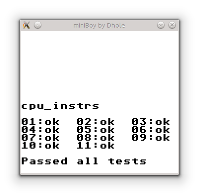

# GameBoy emulator in C (WIP)

This is a GameBoy emulator written from scratch in C, using GameBoy
documentation found online as a reference. It's the second emulator I write 
(the first one was a Chip8 emulator), and the first serious one. The keyboard 
and screen is handled with SDL2. The source code is published under the New
BSD License (See LICENSE).

It's currently playable :D

## Usage

```
./miniBoy [-d BIOS] rom.gb [-d]
```

The emulator can boot without bios (it will set some registers into a knwon
good state). Use the -d to start in debug mode.

Key mappings: Z and X for A and B. Return and Backspace for Start and Select.
Arrow keys for directions. D to enter debug mode.

Debug mode is used from the terminal. It has the following features: stepping,
view CPU registers, set breakpoints, inspect memory regions, dissasamble memory
regions, write values to memory, inspect IO registers, show call trace.

## Status

### Currently implemented
- All CPU instructions (blargg CPU instrs and instr timing tests passed)
- Timer
- Keypad
- Screen (Needs fixes)
- MBC1 and ROM Only cartridges
- Debugger

### TODO
- Sound
- Fix bugs affecting some games
- Implement the rest of Memory Block Controllers (MBC)

### Bugs
- Super Mario Land 2: Sprites are not being drawn
- Kirby Dream Land 2: Blank Screen
- Kirby Dream Land: segfault at gameplay
- Dr. Mario: Hangs when Display Enabling is enabled

### Some Playable games
- Dr. Mario
- Super Mario Land
- Tetris
- The Legend of Zelda, Link's Awakening
- Donkey kong Land
- Doneky Kong Land 2
- Batman

## Screenshots

### Debugger


### Games


### Tests



